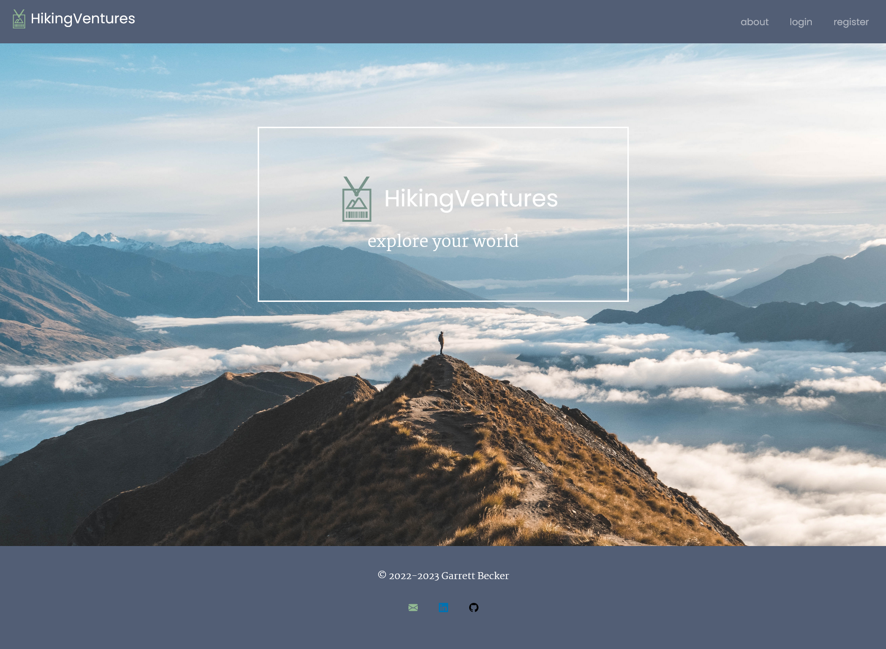
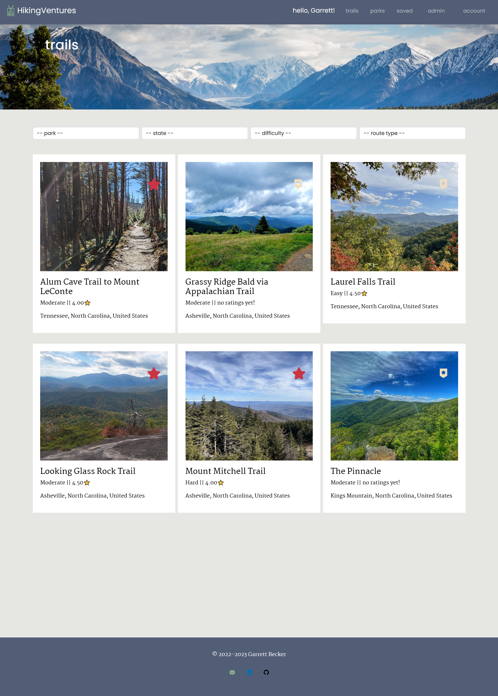
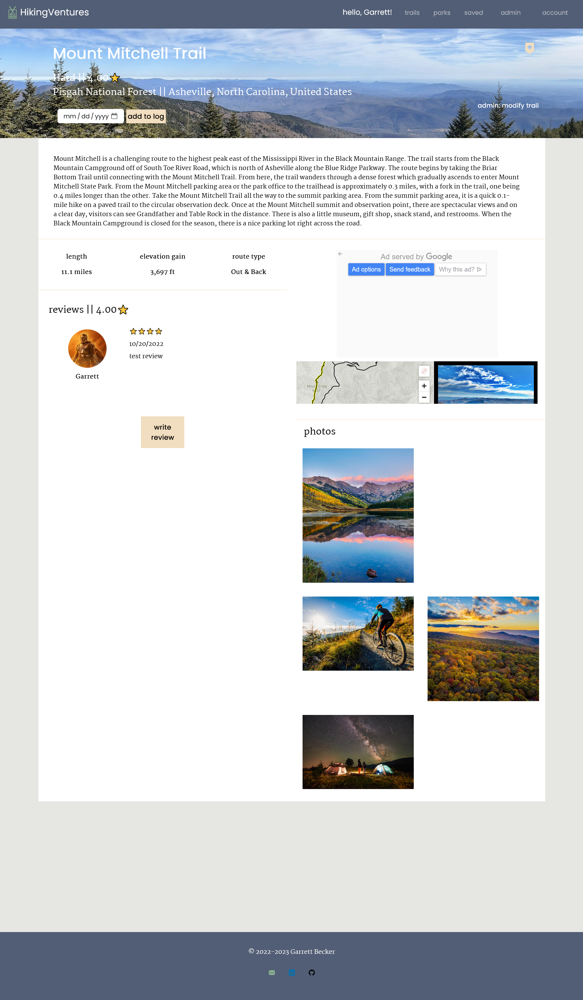

# HikingVentures App
This is a personal capstone project I made as a challenge to synthesize a lot from what I've been learning hodgepodge on my own. It was a total blast figuring this out and I'm very happy with the result!

Hiking is one of my favorite things to do and I wanted to try making a hiking trail and park database app where you could search and filter, find your new favorite trail to add to your favorites, and keep a record of the best places you've been. AllTrails is one of my go-to hiking trail databases and provided a source of inspiration for this project.

## Table of contents

- [HikingVentures App](#hikingventures-app)
  - [Table of contents](#table-of-contents)
    - [Landing Page](#landing-page)
    - [Trails Page](#trails-page)
    - [Trail Detail Page](#trail-detail-page)
    - [Links](#links)
  - [My process](#my-process)
    - [Built with](#built-with)
    - [What I learned](#what-i-learned)
    - [Continued development](#continued-development)
    - [Useful resources](#useful-resources)
  - [Author](#author)
  - [Acknowledgments](#acknowledgments)

### Landing Page



### Trails Page



### Trail Detail Page



### Links

- [Live Site URL](https://hikingventures-gdbecker.replit.app)

## My process

### Built with

- React
- HTML5
- CSS
- Bootstrap
- Python
- Django
- JWT
- Redux
- Djoser
- Axios
- VS Code

### What I learned

As my second landing page with Next.js and SASS, I'm getting a lot more comfortable with using both of these frameworks for building - and Sunnyside's page was deceptively challenging. It looks simple at first, but that's what I really enjoy about working on these challenges: they push you to not simply copy/paste similar code you've written before but problem solve and think through what the needs are for the look and function. On each landing page I've started first with the top navbar, and then go section by section to match up with the design specs. I went for Bootstrap 'container-fluid' classes to get the full page image rows, and tried to keep my HTML as concise as possible. There was quite a bit of CSS tinkering I needed to do as I was figuring out the best way to design for different screen sizes. I feel especially proud for figuring out the mobile drop-down menu with the triangle on the top right - really happy with how this one turned out after persevering through the design challenges!

Here are a few code samples from this project:

```html

```

```css

```

```js

```

### Continued development

As a starter developer, I want to keep growing in working as a team and learning how to deliver robust and beautiful solutions like this one. I thought this project was a good way to get back into React and begin doing just that!

### Useful resources

- [CSS Formatter](http://www.lonniebest.com/FormatCSS/) - I found this helpful site when I'm feeling lazy and don't want to format my CSS code, I can have this do it for me, especially putting everything in alphabetical order.
- [Accessing LocalHost on iPhone](https://stackoverflow.com/questions/3132105/how-do-you-access-a-website-running-on-localhost-from-iphone-browser) - Game changer for developing on mobile and desktop simultaneously! This was very helpful for being able to see my work on my phone before pushing it to production on Netlify or GitHub pages.
- [Bootstrap Containers](https://getbootstrap.com/docs/5.0/layout/containers/) - Handy guide for Bootstrap's docs on container classes. Making Sunnyside's landing page was great practice for using 'container-fluid'

## Author

- Website - [Garrett Becker]()
- Frontend Mentor - [@gdbecker](https://www.frontendmentor.io/profile/gdbecker)
- LinkedIn - [Garrett Becker](https://www.linkedin.com/in/garrett-becker-923b4a106/)

## Acknowledgments

Thank you to the Frontend Mentor team for providing all of these fantastic projects to build, and for our getting to help each other grow!
